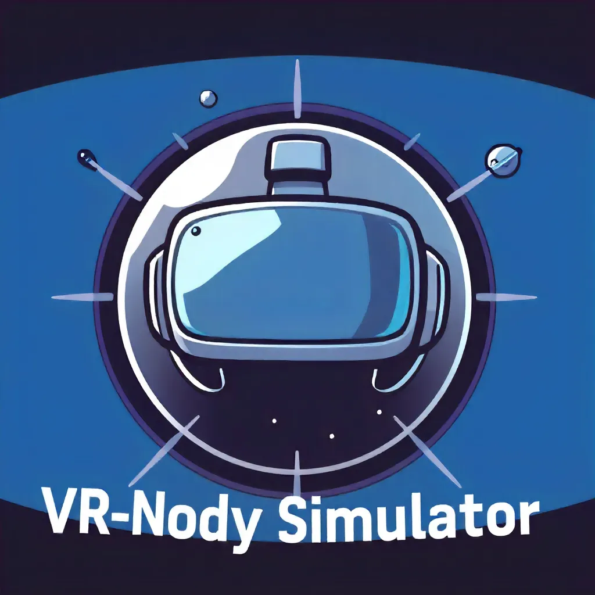
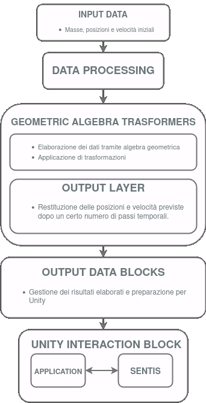

# **N-Body VR Simulator**

<p align="center">
  
</p>

During our internship at **CNR-ICAR**, we developed a project to integrate a neural network model from N-Body problem experiments into an interactive VR environment. This allows users to create and simulate custom planetary systems.

In this environment, users can create planets via a user interface, specifying attributes like mass, position, and velocity. These planets are then visualized as small objects that can be positioned within the simulation area.

The **GATr** (Geometric Algebra Transformer) model processes the planet data to predict their final positions and trajectories. The planets are animated along these trajectories, providing users with a dynamic visualization of the system's evolution.

## Table of Contents

1. [Project Overview](#project-overview)
2. [System Architecture](#system-architecture)
3. [Installation Guide](#installation-guide)
4. [Usage](#usage)
5. [Execution Example](#execution-example)
6. [Issues and Limitations](#issues-and-limitations)
7. [Code Structure](#code-structure)
8. [References](#references)

## **Project Overview**

The N-Body VR Simulator is a project that combines a neural network model with a virtual reality (VR) environment to simulate the motion of celestial bodies. The project is built using the Unity game engine and utilizes the GATr (Geometric Algebra Transformer) model to predict the final positions and trajectories of the celestial bodies. The model is first trained on a dataset of positions and velocities of celestial bodies, and then used to simulate the motion of the bodies in the VR environment. The project is designed to be interactive, allowing users to create and customize their own planetary systems and then simulate their evolution over time.

### Technologies Used

The N-Body VR Simulator project utilizes a range of tecnologies to achieve its goals. Some of them are: 

- **Unity**: A popular game engine for building interactive 3D simulations.
- **GATr**: A neural network model based on Geometric Algebra Transformers for predicting the positions and trajectories of celestial bodies.
- **ONNX**: An open standard for representing machine learning models, used for exporting and importing the GATr model.
- **Python**: A programming language used for developing the GATr model and generating the dataset.
- **C#**: A programming language used for developing the Unity application.

## **System Architecture**

The system consists of two main components:
1. **GATr Neural Network**: Predicts the final trajectories of celestial bodies based on their initial parameters.
2. **Unity Application**: Visualizes the results of the predictions in a VR environment, allowing users to interact with the planets.

<p align="center">
  
</p>


## **Installation Guide**

1. **System Requirements**
* Python 3.10
* Unity 2021.3.23f1
* Docker
* git

2. **Trained ONNX Model Acquisition**
   - Clone the repository:
     ```bash
     git clone https://github.com/H-Alin02/N-BodyVRSimulator.git
     ```
   - Build the Docker image:
     ```bash
     cd GATr
     docker build -f docker/Dockerfile --tag gatr:latest .
     ```
   - Run the Docker image:
     - On Windows:
       ```bash
       docker run --rm -it -v "${PWD}:/workspace" -w /workspace gatr:latest
       ```
     - On Linux:
       ```bash
       sudo docker run --rm -it -v $PWD:$PWD -w $PWD gatr:latest /bin/bash
       ```
   - Generate datasets:
     ```bash
     python scripts/generate_nbody_dataset.py
     ```
   - Train the model:
     ```bash
     python scripts/nbody_experiment.py
     ```
   - Access the trained ONNX model in `Model` inside `GATr/GATrExperiments/experiments/nbody/gatr/models`.

3. **Unity Project Zip Download**

4. **Post Project Opening Steps in Unity**

## **Usage**

Instructions on using the code and Unity project to create a functional build and launch the application on a headset. Interaction details with the simulation.

### Guida all'Uso

1. **Unity Project Opening Steps**

- Open the Unity project in the Unity Editor
- Build the Unity project
- Run the Unity project on the VR headset

2. **Interaction with the Simulation**

- In the game, go to the UI and select the desired planet to create or the star.
- Insert the desired parameters for the planet or the star.
- Click the "Confirm" button to create the planet or the star object.
- Grab the planet and move it inside the portal on the left. The planet will be teleported inside the simulation area. 
- Go back to the UI and create other planets. 
- Go to the simulation area.
- On the UI click the "Start" button to start the simulation.
- Restart the simulation or reset the simulation by clicking the "Reset" button on the UI.

3. **VR Controls**
- **Move**: Left joystick
- **Look Around**: Right joystick
- **Grab**: Right gab trigger

## **Uxecution Example**

### Inference Example in Python

- **Input**: Tensor of dimension [1, 4, 7] (1 sample for 4 planets, 7 parameters)
  - Initial masses: 
    ```
    [0.02146309 0.01986073 1.115385 0.02487979]
    ```
    [0.02146309 0.01986073 1.115385 0.02487979]
    ```
  - Initial positions (x, y, z): 
    ```
    [[-19.30458052  -5.09142425  -1.71743116]
     [-18.95293991  -4.954115    -2.10290605]
     [-18.71318257  -4.56528173  -2.06411723]
     [-18.83038067  -4.12001627  -1.43396349]]
    ```
  - Initial velocities (vx, vy, vz):
    ```
    [[-0.11754325  0.70240116  0.88894977]
     [-0.70086511  0.29593982  1.36838713]
     [ 0.          0.          0.        ]
     [-0.81023741 -0.79165406  0.40258876]]
    ```

-  **Output Data**

    - Predicted final positions (x, y, z), shape [1, 4, 3]:
        ```
        [[[-19.276588   -4.984411   -1.6507224]
            [-19.011372   -4.895467   -1.9541278]
            [-18.735363   -4.571579   -2.0373058]
            [-18.910467   -4.2423964  -1.4385887]]]
        ```
    - Comparison with actual final positions:
        ```
        [[-19.31085362  -5.01661123  -1.63205759]
        [-19.0080462   -4.90257404  -1.96607783]
        [-18.71359161  -4.56564631  -2.06387754]
        [-18.90975347  -4.20430149  -1.40140385]]
        ```

### **Video Demo** 
A video demonstrating the VR environment is available at [this link](https://drive.google.com/file/d/14iajbuJ-bFwVF7ivHumFDVOLlsFbgHqF/view?usp=sharing).

## **Issues and Limitations**

## **Code Structure**

## **References**

- [Geometric Algebra Transformer](https://arxiv.org/abs/2305.18415)

## **License**

